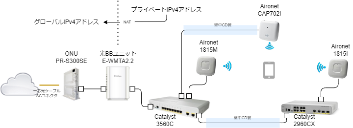
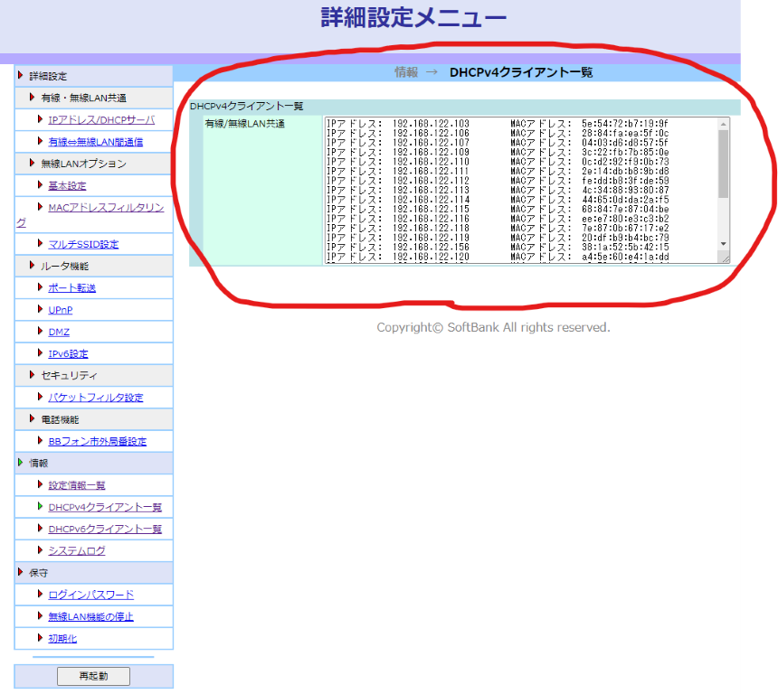
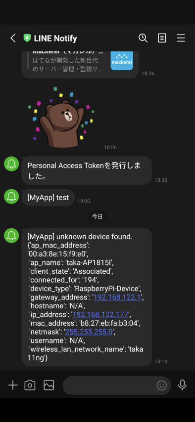
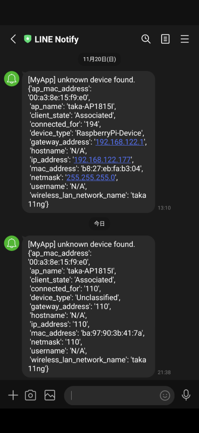
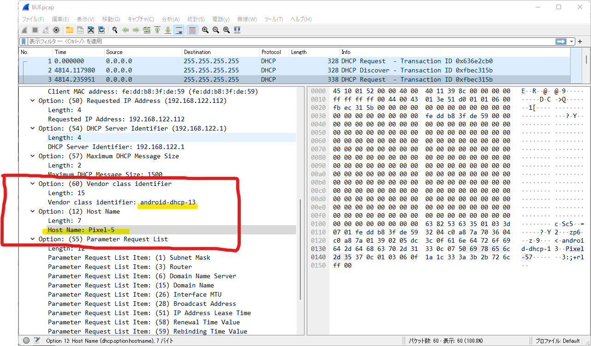

（このページはAdvent Calendar 2022向けに記載したものです）

# 自宅のネットワークに接続している全ての装置のMACアドレスを調べてみた

テレワーク主体の働き方になってから自宅のネットワーク環境を随時強化しています。
強化しているといっても設計書を書くほどのものではないですし、日ごろから管理に手間をかけているわけでもありません。

正直いって何が繋がってるのか把握できてませんので <span style="font-size: 200%;">無法地帯</span> と言われても仕方ありません。

自宅から漏れてる無線LANの電波を拾って接続されてたりしたらアウトです。

ということで自宅のネットワークに何が接続しているのか、調べてみました。

<br>

## 自宅のネットワーク環境

物理トポロジーはこんな感じです。



インターネットはソフトバンク光を契約しています。

ソフトバンク光のルータ（光ＢＢユニット）にPoE対応のCatalyst3560を接続して、そこから2台のAironetに給電しています。

Catalyst3560から有線LANを伸ばして別の部屋のCatalyst2960に接続しています。その周辺がテレワーク環境です。

特別なことは何もない、ごく一般的な普通の環境です。

<br>

## 無線LANの設計

無線LAN環境は2.4GHzを使う802.11gのSSIDと、5GHzを使う802.11a系のSSIDで分けています。
802.11aが出始めの頃に購入した家庭用アクセスポイントがそのような設計しかできなかったのをいまだに引きずってます

（これは良い設計ではないことを後に痛感することになります）


<br>

## DHCPサーバの情報を採取

IPアドレスはソフトバンクのルータ（光ＢＢユニット）からDHCPで払いだされます。

DHCPサーバが払いだしているIPアドレスの情報がわかれば、接続している端末の多くは把握できそうです。

これ（↓）は光ＢＢユニットの管理画面です。



<br>

この赤く囲った部分の情報を採取したいわけですが、光ＢＢユニットの機種が古いこともあってAPIでの情報採取はおろか、SSHでの接続もできません。
接続プロトコルはHTTP、認証はベーシック認証です。HTTPSですらありません。

仕方ないのでPythonのrequestsモジュールで該当ページのURLに接続してスクレイピングすることにします。

たまにしか使わない機器もいるでしょうから一時間に１回、DHCPの払い出し情報を採取してデータベースに格納します。

これでIPアドレスとMACアドレスの対応がわかりますので、あとはMACアドレスのベンダーコードをみて物が何かを推察してみます。

ソースコード [bin/collect_dhcp_clients.py](https://github.com/takamitsu-iida/home-network/blob/main/bin/collect_dhcp_clients.py)

<br>

## 分析してみた

こちらのサイト（↓）からMACアドレスのベンダー情報をダウンロードさせていただきました。

<p><a href="https://maclookup.app/downloads/json-database" target="_blank">https://maclookup.app/downloads/json-database</a></p>

JSON形式でダウンロードしたものをMACアドレスの文字列順でソートしてからtinydbに保存しておきます（ソートはバイナリサーチできるようにするためです）。

ソースコード [bin/collect_mac_vendors.py](https://github.com/takamitsu-iida/home-network/blob/main/bin/collect_mac_vendors.py)

このMACアドレスのベンダーコードのデータベースを使って、自宅LANにいるMACアドレスを検索してみました。

ソースコード [bin/analyze.py](https://github.com/takamitsu-iida/home-network/blob/main/bin/analyze.py)

その結果がこちら。

| mac               | ip              | vendor                                             |
|-------------------|-----------------|----------------------------------------------------|
| 90:9A:4A:D6:BB:B9 | 192.168.122.159 | TP-LINK TECHNOLOGIES CO.,LTD.                      |
| 38:1A:52:5B:42:15 | 192.168.122.156 | Seiko Epson Corporation                            |
| 28:84:FA:EA:5F:0C | 192.168.122.106 | SHARP Corporation                                  |
| 04:03:D6:D8:57:5F | 192.168.122.107 | Nintendo Co.,Ltd                                   |
| A0:C9:A0:9A:7F:01 | 192.168.122.130 | Murata Manufacturing Co., Ltd.                     |
| 90:B6:86:CF:B7:BA | 192.168.122.176 | Murata Manufacturing Co., Ltd.                     |
| BC:83:85:CE:44:74 | 192.168.122.102 | Microsoft Corporation                              |
| 84:5C:F3:48:FF:30 | 192.168.122.169 | Intel Corporate                                    |
| 4C:34:88:93:80:87 | 192.168.122.113 | Intel Corporate                                    |
| 0C:D2:92:F9:0B:73 | 192.168.122.110 | Intel Corporate                                    |
| 20:DF:B9:B4:BC:79 | 192.168.122.119 | Google, Inc.                                       |
| 9C:5F:5A:92:94:27 | 192.168.122.142 | GUANGDONG OPPO MOBILE TELECOMMUNICATIONS CORP.,LTD |
| 68:84:7E:87:04:BE | 192.168.122.115 | FUJITSU LIMITED                                    |
| 08:97:98:04:22:E4 | 192.168.122.160 | COMPAL INFORMATION (KUNSHAN) CO., LTD.             |
| 3C:22:FB:7B:85:0E | 192.168.122.109 | Apple, Inc.                                        |
| A4:5E:60:E4:1A:DD | 192.168.122.120 | Apple, Inc.                                        |
| AC:29:3A:C5:D7:8C | 192.168.122.146 | Apple, Inc.                                        |
| 44:65:0D:DA:2A:F5 | 192.168.122.114 | Amazon Technologies Inc.                           |
| 74:75:48:C6:25:06 | 192.168.122.144 | Amazon Technologies Inc.                           |
| 50:EB:F6:95:8B:37 | 192.168.122.174 | ASUSTek COMPUTER INC.                              |
| 5E:54:72:B7:19:9F | 192.168.122.103 |                                                    |
| 2E:14:DB:B8:9B:D8 | 192.168.122.111 |                                                    |
| FE:DD:B8:3F:DE:59 | 192.168.122.112 |                                                    |
| EE:E7:80:E3:C3:B2 | 192.168.122.116 |                                                    |
| 7E:87:0B:67:17:E2 | 192.168.122.118 |                                                    |
| C6:78:AD:69:2D:FD | 192.168.122.121 |                                                    |
| 12:87:66:76:E7:7D | 192.168.122.122 |                                                    |
| 26:67:CA:BE:BC:C9 | 192.168.122.123 |                                                    |
| BE:99:E6:5E:E0:ED | 192.168.122.151 |                                                    |
| F6:FF:CC:5F:51:68 | 192.168.122.172 |                                                    |
| 54:3D:1F:FA:CB:6F | 192.168.122.145 |                                                    |
| E6:02:29:6F:AE:FE | 192.168.122.149 |                                                    |

- total mac addresses: 32
- unknown vendor: 12 (37.5)%

32個のMACアドレスのうち12個は製造元不明という結果でした。

それにしても<span style="font-size: 200%;">MACアドレスが製造元不明って・・・　これはいったいどういうことでしょう？</span>

<br><br><br>

## ランダムMACアドレス

最近のandroidやiOSは無線LANに接続する際にランダムなMACアドレスを使うそうです。
スマホの設定画面を見ると確かにそう書いてあります。

この辺りが参考になります。

> Apple　<a href="https://support.apple.com/ja-jp/HT211227" target="_blank">iPhone、iPad、iPod touch、Apple Watch でプライベート Wi-Fi アドレスを使う</a>

> Android <a href="https://source.android.com/docs/core/connect/wifi-mac-randomization" target="_blank">MACアドレスランダム化の実装</a>

ランダムといっても無線LANに接続するたびに変わるわけではなく、接続先ごとに使うMACアドレスを決めたら変わることはありません。

このときに使われるMACアドレスは「プライベートMACアドレス」と呼ばれるものになります。

<br>

## プライベートMACアドレスとは

MACアドレスの先頭1オクテットは、そのアドレスがどういう種別のものなのかを表す重要な部分です。


先頭1オクテットをビットに展開したときの下一桁の部分は、そのMACアドレスがユニキャストなのか、マルチキャストなのかを表します。
このビットが1だとマルチキャストです。

つまり <span style="font-size: 200%;">先頭1オクテットが奇数の場合はマルチキャストMACアドレス</span> と言うことができます。

代表的なマルチキャストMACドレスにはこのようなものがあります。

例： 01:00:5E は先頭１オクテットが01で奇数なのでマルチキャスト(IPマルチキャスト)

例： 01:00:0C は先頭１オクテットが01で奇数なのでマルチキャスト(Cisco独自 PVST/CDP/VTP/UDLD等)

例： 01:80:C2 は先頭１オクテットが01で奇数なのでマルチキャスト(LLDPやBPDU等IEEE 802系)

例： 33:33:XX は先頭１オクテットが33で奇数なのでマルチキャスト(IPv6マルチキャスト)

先頭1オクテットが偶数の場合はユニキャストになりますが、さらにその中でも下二桁目のビットが1の場合はプライベートMACアドレスになります。


<span style="font-size: 200%;">先頭1オクテットの数字が 2 か 6 か A か E で終わる場合はプライベートMACアドレス</span> ということになります。

先ほど製造元が不明だったMACアドレスを抜き出して整理するとこうなります。


| 5E:54:72:B7:19:9F | 先頭1オクテットがEで終わるのでプライベートMACアドレス |
| 2E:14:DB:B8:9B:D8 | 先頭1オクテットがEで終わるのでプライベートMACアドレス |
| FE:DD:B8:3F:DE:59 | 先頭1オクテットがEで終わるのでプライベートMACアドレス |
| EE:E7:80:E3:C3:B2 | 先頭1オクテットがEで終わるのでプライベートMACアドレス |
| 7E:87:0B:67:17:E2 | 先頭1オクテットがEで終わるのでプライベートMACアドレス |
| 12:87:66:76:E7:7D | 先頭1オクテットが2で終わるのでプライベートMACアドレス |
| C6:78:AD:69:2D:FD | 先頭1オクテットが6で終わるのでプライベートMACアドレス |
| F6:FF:CC:5F:51:68 | 先頭1オクテットが6で終わるのでプライベートMACアドレス |
| 26:67:CA:BE:BC:C9 | 先頭1オクテットが6で終わるのでプライベートMACアドレス |
| E6:02:29:6F:AE:FE | 先頭1オクテットが6で終わるのでプライベートMACアドレス |
| 54:3D:1F:FA:CB:6F | これは何？                                        |


たしかに先頭1オクテットが E, 2, 6 で終わっています。これらはAndroidもしくはiOSと考えてよさそうです。

なんだか多すぎるような気もしますが、それは気のせいではなく本当に多すぎです。

どのMACアドレスがどのスマホなのかを調べたいわけですが、プライベートMACアドレスでは製造元すらわかりません。
さてどうしましょう。

さらに、1個だけプライベートMACアドレスではないのに、製造元が不明なものがありますね。

これは何だろう？　気持ち悪いですね。

<br>

## MACアドレスのベンダー名だけで判断できない物はどうする？

ベンダー名をみて物が何か類推できるものもあれば、そうでないものもあります。

NintendoとかApple、FUJITSUなんかは分かりやすいです。心当たりもあります。

確実に分かるもの

- SHARP Corporation はテレビです。有線LANで接続していますので間違いありません。
- Nintendo Co.,Ltd は任天堂のSWITCHです。使ってなくても常時無線LANに接続しているんですね。アップデートのためかな。
- Apple, Inc. のうち2台はMacBook Proです。日常的に使ってますので間違いありません。
- FUJITSU LIMITED は会社のパソコンです。これも日常的に使ってますので間違いありません。
- Google, Inc. はGoogle Home Miniです。GoogleはちゃんとOUIを持ってるんですね。
- Seiko Epson Corporation はプリンタです。使っていなくても常時無線LANに接続しています。
- TP-LINK TECHNOLOGIES CO.,LTD. は電源（コンセント）をスマホでON-OFFするやつです。
- ASUSTek COMPUTER INC. は自作PCです。いままさにこのページを書いてるPCですので間違いありません。

分からないもの
- Amazon Technologies Inc. はKindleかテレビのHDMIに差し込んでるやつのどっちかだと思うけど、正確にはわからないです。Kindleは子供用にもう一台あるはずが電源を入れてないので検知できてません。
- Intel Corporate は漠然としすぎてわからないです。複数あるのでどれが何なのか。
- Murata Manufacturing Co., Ltd. は村田製作所ですね。複数ありますが物は何なのか想像つかないです。
- COMPAL INFORMATION (KUNSHAN) CO., LTD. は何だろう？聞いたことない会社です。

ということで<span style="font-size: 200%;">ベンダーコードだけで物を特定するのは困難</span>だということを改めて痛感しました。

ところで自宅の無線LANに使っているAironetはMobility Expressという機能を持っていまして、無線LANコントローラを内臓しています。

無線LANコントローラはこの画面（↓）の通り、接続している無線LAN端末のホスト名やOSの種類まで特定してくれています。


おそらくDHCPのやり取りを盗み見ることで分かる情報だと思いますが、たいへん有益な情報なのでこれも採取して分析に加えてみましょう。

無線LANコントローラからAPIで情報を採取できるとよかったのですが、やり方が分かりませんでしたので、手っ取り早くPythonのNetmikoモジュールを使ってコマンドで採取してみます。

無線LANコントローラにSSHで乗り込んで `show client summary` というコマンドを実行するとMACアドレスの一覧が手に入ります。

```bash
(Cisco Controller) >show client summary

Number of Clients................................ 15

Number of EoGRE Clients.......................... 0

                                                                RLAN/
MAC Address       AP Name                        Slot Status        WLAN  Auth Protocol         Port Wired Tunnel  Role
----------------- ------------------------------ ---- ------------- ----- ---- ---------------- ---- ----- ------- ------
04:03:d6:d8:57:5f living-AP1815M                  0   Associated     2    Yes   802.11n(2.4 GHz) 1    N/A   No      Local
08:97:98:04:22:e4 living-AP1815M                  0   Associated     2    Yes   802.11n(2.4 GHz) 1    N/A   No      Local
20:df:b9:b4:bc:79 taka-AP1815I                    1   Associated     1    Yes   802.11ac(5 GHz)  1    N/A   No      Local
2e:14:db:b8:9b:d8 ayane-CAP702I                   1   Associated     1    Yes   802.11n(5 GHz)   1    N/A   No      Local
38:1a:52:5b:42:15 living-AP1815M                  0   Associated     2    Yes   802.11n(2.4 GHz) 1    N/A   No      Local
3c:22:fb:7b:85:0e taka-AP1815I                    1   Associated     1    Yes   802.11ac(5 GHz)  1    N/A   No      Local
44:65:0d:da:2a:f5 living-AP1815M                  0   Associated     2    Yes   802.11n(2.4 GHz) 1    N/A   No      Local
7e:87:0b:67:17:e2 living-AP1815M                  1   Associated     1    Yes   802.11ac(5 GHz)  1    N/A   No      Local
```

さらに `show client detail <MACアドレス>` コマンドを使うと、デバイスタイプ（この例ではNintendoWII）等の詳細情報が手に入ります。

```bash
(Cisco Controller) >show client detail 04:03:d6:d8:57:5f
Client MAC Address............................... 04:03:d6:d8:57:5f
Client Username ................................. N/A
Client Webauth Username ......................... N/A
Hostname: .......................................
Device Type: .................................... NintendoWII
AP MAC Address................................... 70:ea:1a:84:16:c0
AP Name.......................................... living-AP1815M
AP radio slot Id................................. 0
Client State..................................... Associated
User Authenticated by ........................... None
Client User Group................................
Client NAC OOB State............................. Access
Wireless LAN Id.................................. 2
Wireless LAN Network Name (SSID)................. taka 11ng
Wireless LAN Profile Name........................ taka 11ng
WLAN Profile check for roaming................... Disabled
Hotspot (802.11u)................................ Not Supported
Connected For ................................... 266 secs
BSSID............................................ 70:ea:1a:84:16:c1
Channel.......................................... 6
IP Address....................................... 192.168.122.107
Gateway Address.................................. 192.168.122.1
```

接続中の無線クライアントの情報しか表示できませんので、この情報も１時間に一回採取してデータベースに格納しておきます。

ソースコード [bin/collect_wlc_clients](https://github.com/takamitsu-iida/home-network/blob/main/bin/collect_wlc_clients.py)


<br>

## 無線LANコントローラの情報を加えて分析してみた

無線LANコントローラから得られる情報も付加して分析した結果がこちら。

| mac               | ip              | vendor                                             | type                            | hostname                 | ap             | ssid      |
|-------------------|-----------------|----------------------------------------------------|---------------------------------|--------------------------|----------------|-----------|
| 90:9A:4A:D6:BB:B9 | 192.168.122.159 | TP-LINK TECHNOLOGIES CO.,LTD.                      | Unclassified                    | N/A                      | taka-AP1815I   | taka 11ng |
| 38:1A:52:5B:42:15 | 192.168.122.156 | Seiko Epson Corporation                            | Unclassified                    | N/A                      | living-AP1815M | taka 11ng |
| 28:84:FA:EA:5F:0C | 192.168.122.106 | SHARP Corporation                                  |                                 |                          |                |           |
| 04:03:D6:D8:57:5F | 192.168.122.107 | Nintendo Co.,Ltd                                   | NintendoWII                     | N/A                      | living-AP1815M | taka 11ac |
| A0:C9:A0:9A:7F:01 | 192.168.122.130 | Murata Manufacturing Co., Ltd.                     | Android-Samsung-Galaxy-Phone-S8 | Galaxy-S8                | taka-AP1815I   | taka 11ac |
| 90:B6:86:CF:B7:BA | 192.168.122.176 | Murata Manufacturing Co., Ltd.                     | Android                         | Galaxy-S6-edge           | taka-AP1815I   | taka 11ac |
| BC:83:85:CE:44:74 | 192.168.122.102 | Microsoft Corporation                              | Microsoft-Workstation           | DESKTOP-DAONSME          | ayane-CAP702I  | taka 11ac |
| 84:5C:F3:48:FF:30 | 192.168.122.169 | Intel Corporate                                    | Microsoft-Workstation           | DESKTOP-6AS7DS0          | living-AP1815M | taka 11ng |
| 4C:34:88:93:80:87 | 192.168.122.113 | Intel Corporate                                    | Microsoft-Workstation           | mayo-PC                  | living-AP1815M | taka 11ac |
| 0C:D2:92:F9:0B:73 | 192.168.122.110 | Intel Corporate                                    | Microsoft-Workstation           | NMV-CF-SV-2              | taka-AP1815I   | taka 11ac |
| 20:DF:B9:B4:BC:79 | 192.168.122.119 | Google, Inc.                                       | Linux-Workstation               | Google-Home-Mini         | taka-AP1815I   | taka 11ac |
| 9C:5F:5A:92:94:27 | 192.168.122.142 | GUANGDONG OPPO MOBILE TELECOMMUNICATIONS CORP.,LTD | Android                         | OPPO-Reno-A              | taka-AP1815I   | taka 11ac |
| 68:84:7E:87:04:BE | 192.168.122.115 | FUJITSU LIMITED                                    |                                 |                          |                |           |
| 08:97:98:04:22:E4 | 192.168.122.160 | COMPAL INFORMATION (KUNSHAN) CO., LTD.             | Unclassified                    | N/A                      | living-AP1815M | taka 11ng |
| 3C:22:FB:7B:85:0E | 192.168.122.109 | Apple, Inc.                                        | OS_X-Workstation                | iida-macbook-pro         | taka-AP1815I   | taka 11ac |
| A4:5E:60:E4:1A:DD | 192.168.122.120 | Apple, Inc.                                        | OS_X-Workstation                | iidamac2                 | living-AP1815M | taka 11ac |
| AC:29:3A:C5:D7:8C | 192.168.122.146 | Apple, Inc.                                        | Apple-iPhone                    | iidataknoiPhone          | living-AP1815M | taka 11ac |
| 44:65:0D:DA:2A:F5 | 192.168.122.114 | Amazon Technologies Inc.                           | Amazon Device                   | N/A                      | living-AP1815M | taka 11ng |
| 74:75:48:C6:25:06 | 192.168.122.144 | Amazon Technologies Inc.                           | Amazon Device                   | N/A                      | taka-AP1815I   | taka 11ng |
| 50:EB:F6:95:8B:37 | 192.168.122.174 | ASUSTek COMPUTER INC.                              |                                 |                          |                |           |
| 5E:54:72:B7:19:9F | 192.168.122.103 |                                                    | iPhone12,8                      | N/A                      | taka-AP1815I   | taka 11ac |
| 2E:14:DB:B8:9B:D8 | 192.168.122.111 |                                                    | iPad 6th Gen                    | N/A                      | living-AP1815M | taka 11ac |
| FE:DD:B8:3F:DE:59 | 192.168.122.112 |                                                    | Android                         | Pixel-5                  | taka-AP1815I   | taka 11ac |
| EE:E7:80:E3:C3:B2 | 192.168.122.116 |                                                    | iPhone 8                        | N/A                      | ayane-CAP702I  | taka 11ac |
| 7E:87:0B:67:17:E2 | 192.168.122.118 |                                                    | iPhone12,8                      | N/A                      | living-AP1815M | taka 11ac |
| C6:78:AD:69:2D:FD | 192.168.122.121 |                                                    | Unclassified                    | N/A                      | living-AP1815M | taka 11ng |
| 12:87:66:76:E7:7D | 192.168.122.122 |                                                    | Android                         | Pixel-4a                 | living-AP1815M | taka 11ac |
| 26:67:CA:BE:BC:C9 | 192.168.122.123 |                                                    | iPhone12,8                      | N/A                      | taka-AP1815I   | taka 11ng |
| BE:99:E6:5E:E0:ED | 192.168.122.151 |                                                    | Android                         | Pixel-3                  | living-AP1815M | taka 11ac |
| F6:FF:CC:5F:51:68 | 192.168.122.172 |                                                    | Android                         | N/A                      | taka-AP1815I   | taka 11ac |
| 54:3D:1F:FA:CB:6F | 192.168.122.145 |                                                    | Android                         | android-9a1a18732678477a | living-AP1815M | taka 11ac |
| E6:02:29:6F:AE:FE | 192.168.122.149 |                                                    | Android                         | Pixel-3-XL               | taka-AP1815I   | taka 11ac |

<br>

最初はなかなか情報が埋まらなかったのですが、１週間に渡りWLCから情報を採取し続けた結果、全てのMACアドレスが明確になりました。

<br>

A0:C9:A0:9A:7F:01 | Murata Manufacturing Co., Ltd. | Galaxy-S8
90:B6:86:CF:B7:BA | Murata Manufacturing Co., Ltd. | Galaxy-S6-edge

ベンダーコードが村田製作所になっているのは古いスマホ（Galaxy S8とS6）でした。

昔のGalaxyって村田製作所のチップを使ってたんですね。知りませんでした。これらは主にカメラとして再利用しています。

<br>

44:65:0D:DA:2A:F5 | Amazon Technologies Inc. | living-AP1815M
74:75:48:C6:25:06 | Amazon Technologies Inc. | taka-AP1815I

ベンダーコードがAmazonのものは、接続しているアクセスポイントで物を特定できました。
リビングのアクセスポイント（living-AP1815M）にジョインしているのはテレビのHDMIにくっ付けてるFire TV Stickです。
テレワーク環境のアクセスポイント（taka-AP1815I）にジョインしているのはKindle PaperWhiteです。

自宅内で移動しても通信が途切れないように複数のアクセスポイントを設置していたのが功を奏しました。

<br>

3C:22:FB:7B:85:0E | Apple, Inc. | OS_X-Workstation | iida-macbook-pro
A4:5E:60:E4:1A:DD | Apple, Inc. | OS_X-Workstation | iidamac2
AC:29:3A:C5:D7:8C | Apple, Inc. | Apple-iPhone     | iidataknoiPhone

Appleのベンダーコードのうち2台はMacbook proなのは分かっていたのですが、もう一台は古いiPhoneということが分かりました。
ランダムなMACアドレスを使うように仕様が変わる前のバージョンのiOSで動いています。それにしても`iidataknoiPhone`ってひどいホスト名ですね。

<br>

84:5C:F3:48:FF:30 | Intel Corporate | Microsoft-Workstation | DESKTOP-6AS7DS0
4C:34:88:93:80:87 | Intel Corporate | Microsoft-Workstation | mayo-PC
0C:D2:92:F9:0B:73 | Intel Corporate | Microsoft-Workstation | NMV-CF-SV-2

Intelのベンダーコードは全部で3台ありますが全てWindowsを搭載したノートパソコンでした。
パソコン用の無線LANのNICはIntel率が高いですね。

<br>

54:3D:1F:FA:CB:6F | Android | android-9a1a18732678477a

プライベートMACアドレスではないにもかかわらず製造元ベンダーコードが不明のこの装置。正体はスマホでした。
中国のUlefoneという会社のArmor2という、日本では売ってないスマホです。
魚群探知機のモニターとして使っていますので、釣りに行く前後で充電したりアプリのアップデートをしたり、といったときだけネットワークに繋がります。

それにしても勝手にMACアドレスのベンダーコードを使ってるのかな？　怪しさ満点です。

<br>

F6:FF:CC:5F:51:68 | Android

WLCの情報を付加してもAndroidということしかわからなかったこのプライベートMACの正体は社給のスマホでした。
同じandroidでも新しいスマホほど、WLCでも正体不明になる確率が高い傾向にあります。

<br>

08:97:98:04:22:E4 | COMPAL INFORMATION (KUNSHAN) CO., LTD. | Unclassified

聞いたこともないこのCOMPALという会社の装置、リビングのアクセスポイントに2.4GHz 802.11ngで接続していることをヒントに探索した結果、Wear OS by Googleを搭載したスマートウォッチSkagen Flaster3でした。
いずれはこういうウェアラブルデバイスもプライベートMACアドレスを使いだすのかもしれません。

<br>

C6:78:AD:69:2D:FD | Unclassified

WLCの情報でもUnclassifiedになってしまっていたこの装置の正体はGoogleのスマホPixel-4aでした。

自宅の環境は2.4GHzと5GHzで使うSSIDを分けていますので、同じAndroidスマホでも接続するSSIDによってMACアドレスが変わってしまいます。
たまたま802.11ng側に繋がってしまった時の記録がこれでした。

<br>

E6:02:29:6F:AE:FE | 192.168.122.149 | Android | Pixel-3-XL

そして今回、一番発見するのが難しかったのがこれ。たまにしか電源を入れない古いスマホです。
DHCPサーバがアドレスを払い出した記録はあるものの、無線LANコントローラではなかなか補足できずにいました。
結局これの正体が判明するまで１週間かかりました。

<br><br><br>

## 知らないMACアドレスがネットワーク上に現れたらLINEに通知してみる

ここまでの調査は、

1. DHCPサーバが払い出したIPアドレスとMACアドレスの対応情報
2. 無線LANコントローラが持っているデバイスに関する情報

この二つを定期的に採取して突き合わせる方法でした。

この調査のおかげで多くのデバイスが既知になりましたので、ここからはネットワーク上で未知のMACアドレスを検知したら通報する、という方法に切り替えます。

10分に一度、無線LANコントローラに接続して接続端末の情報を収集して、未知のものを見つけたらLINEで通知するようにします。
この手の通知はLINEが簡単です。面倒な認証周りの処理が不要で、固定のURLにHTTPSでPOSTするだけで通知できます。
Pythonならrequestsモジュールを使って数行書くだけです。

しばらく運転してみて、何も見つからなければ自宅ネットワークは晴れて無法地帯ではないと言い切れるでしょう。

ソースコード [bin/detect.py](https://github.com/takamitsu-iida/home-network/blob/main/bin/detect.py)

調査開始：　2022年11月19日（土）にデーモンとしてスクリプトを起動

調査終了：　2022年11月27日（日）にデーモンを停止

その結果です。通知は２件でした。


### 通知１件目



ラズパイを無線LANにつないだ時に通知されました。ラズパイは普段は有線LANですが、無線LANにつないだことで検出されました。

### 通知２件目



通知があってからすぐにWLCの画面を確認したのですが、そのときにはすでにこのMACアドレスの端末はいなくなっていました。
ですが、子供が家に帰ってきたタイミングで検知したことから推測できました。

おそらく802.11gの方が遠くまで屋外に漏れているんだと思います。
屋外にいるうちに先に11gでアソシエーションして、自宅に着いたら11aに接続が切り替わっただけで、物としては同じiPhone SEでした。
やっぱり同じSSIDで802.11gと11aの両方を吹くべきです。

<br><br>

# 考察

自宅のネットワークに接続しているデバイスの情報を洗い出してみて、怪しい装置がいないことを確認できただけでなく、ためになる気づきもいくつかありました。

<br>

## 気づき１．プライベートMACアドレスの利用が浸透してきている

プライベートMACアドレスについては、そういえばそんな話しを聞いたことあるなぁ、程度の認識でしたが、予想以上に使われてます。
会社の無線LANに接続するためには事前にMACアドレスの申請が必要、みたいなところは今でもあるんじゃないでしょうか。
MACアドレスを基に接続可否を制御する仕組みは利便性が悪くなってきています。

昨今のandroid, iPhoneはプライベートMACアドレスを使いますし、無線LANコントローラで把握できる情報も減ってきています。
セキュリティの観点では好ましい動きだと思いますが、ネットワークの観点では少々やっかいですね。

<br>

## 気づき２．プライベートMACアドレスは先頭1オクテットが2か6かAかEで終わる

Catalystの `show mac address-table` コマンドをみたら、MACアドレスの先頭１オクテットが何かを確認するといいです。

先頭１オクテットが奇数ならマルチキャストMACアドレス、偶数はユニキャストMACアドレスです。

ユニキャストの中でも先頭１オクテットが2か6かAかEで終わってたら、それはプライベートMACアドレスなので、製造元を検索するのはやめましょう。
時間の無駄ですので。

<br>

## 気づき３．SSIDを周波数で分けるのはやめよう

その昔、自宅で使ってたアクセスポイントは802.11aと802.11gでチップが異なっていたせいか、別々のSSIDにしないといけませんでした。

今どきのスマホは接続する無線LANごと、つまりSSIDごとに使うMACアドレスが変わります。
同じスマホなのに接続するSSIDによって違うMACアドレスの装置としてネットワーク上に登場することになりますので、
ネットワークを管理する側の目線ではあまり好ましいことではありません。

SSIDは一つにして802.11aと11gの両方の電波を吹くべきです。

<br>

## 気づき４．DHCPサーバは高機能な方が好ましい

今回は無線LANコントローラの情報が装置の特定に貢献してくれましたが、おそらく情報ソースはDHCPサーバとのやり取りです。
DHCPサーバが高機能なものであれば、同等の情報が得られる可能性が高いです。

ちなみにandroid 13のPixel5が送信するDHCP Requestメッセージはこのようなオプションを付けています。



Option60で`android-dhcp-13`を通知していますので、これでandroidのバージョンが分かります。

Option12で`Pixel-5`を通知していますので、これでデバイス名がわかります。

DHCP Requestメッセージはブロードキャストなのでモニターポートは不要です。
手間はかかりますがWiresharkでDHCPパケットをキャプチャすれば、どんなデバイスがLAN上にいるか分かると思います。

<br>

## 気づき５．テレメトリは大事

無線LANコントローラはその時点の情報しか教えてくれません。
端末がいつ接続して、いつ離れたか、どのくらいの通信量だったか、といった過去からのふるまいを分析することで物が何か判定できるかもしれません。
万が一、ダークサイドに落ちた装置がネットワーク上にいたら、そういった記録はとても大事なものになります。

今回は物が何かを特定できればよかったので、定期的に無線LANコントローラの情報をデータベースに保存して、あとから分析する方法をとりましたが、本来なら製品に組み込まれていてほしい機能です。

近い将来、あらゆる製品がクラウド管理型になって、テレメトリもクラウドで管理されるようになるのかもしれません。

<br><br><br><br>

# 最後に

2022年もたいへんお世話になりました。

来年もよろしくお願いいたします。
