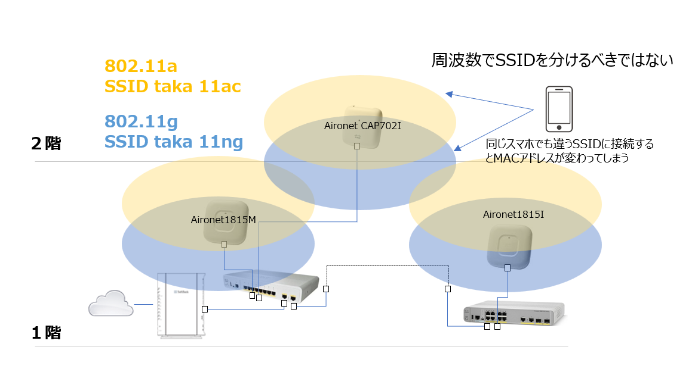
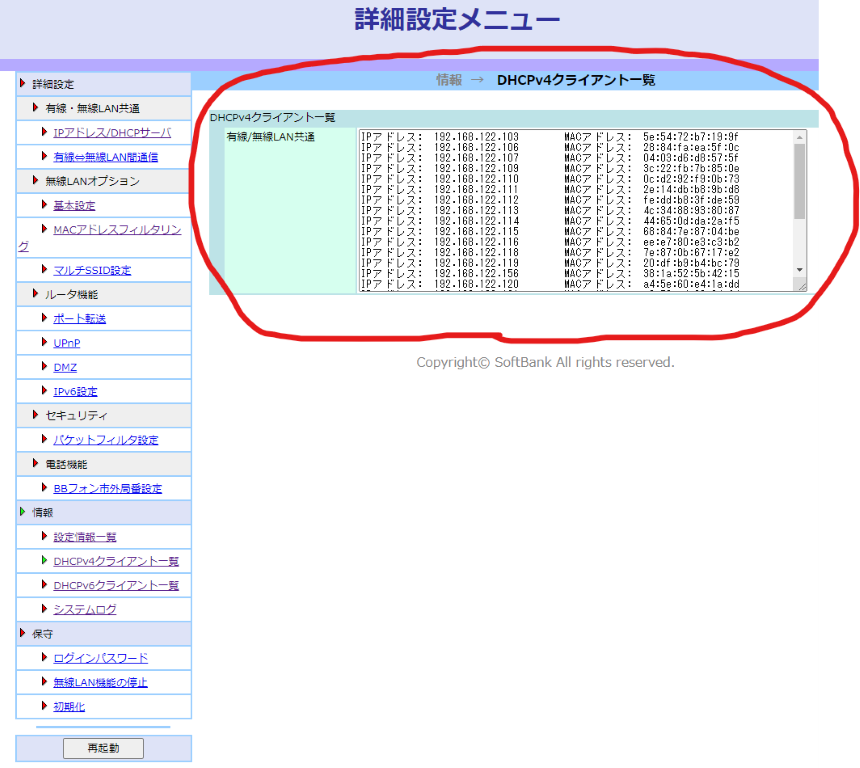
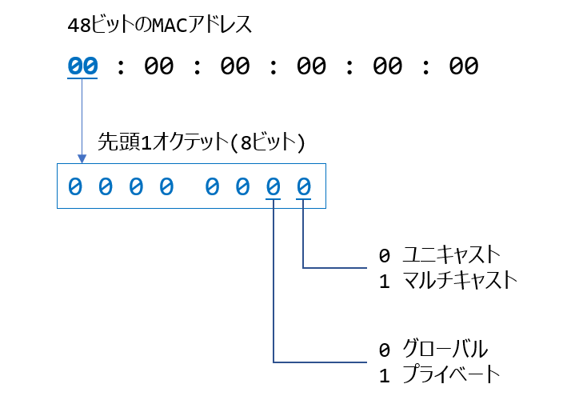
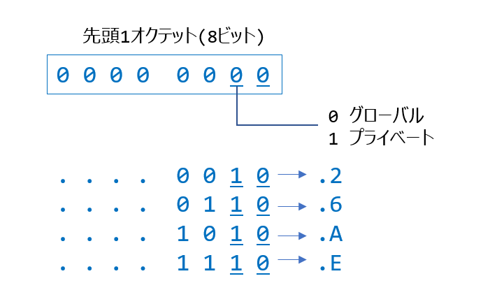
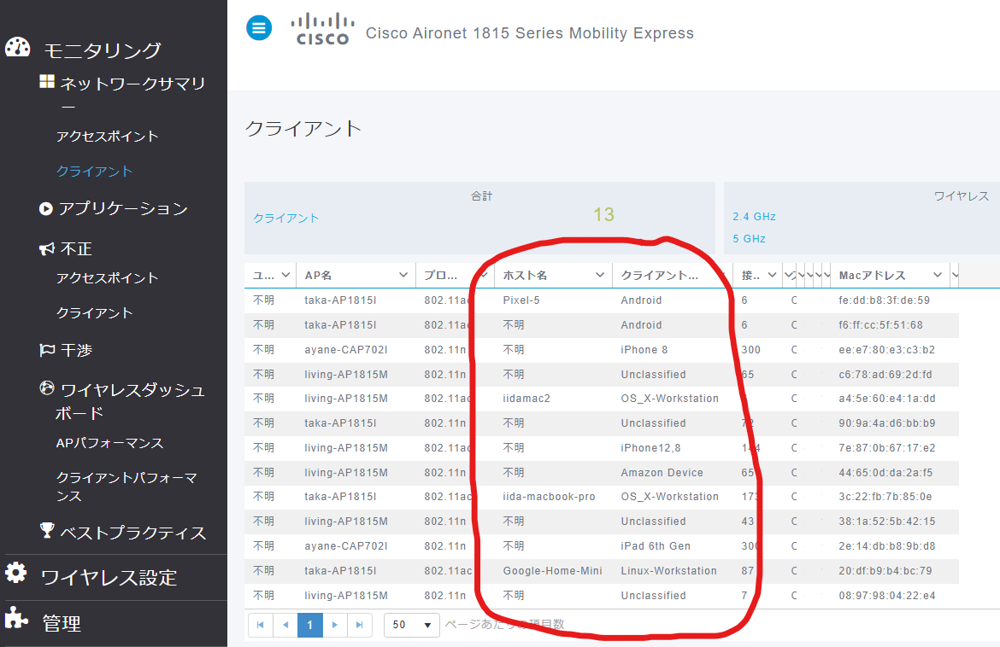
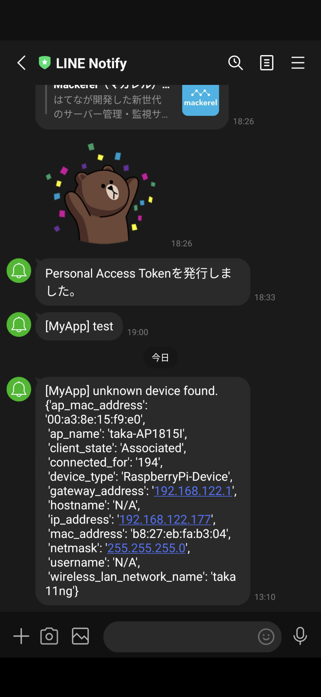

（このページはAdvent Calendar 2022向けに執筆したものです）

# 自宅のネットワークに接続している装置のMACアドレスを全て調べてみた

テレワーク主体の働き方になってから自宅のネットワーク環境を随時強化しています。
強化しているといっても設計書を書くほどのものではないですし、日ごろから管理に手間をかけているわけでもありません。

正直いって何が繋がってるのか把握できてませんので <span style="font-size: 200%;">無法地帯</span> です。

自宅から漏れてる無線LANの電波を拾って接続されてたりしたらアウトです。
ということで自宅のネットワークに何が接続しているのか、たまには調べてみようと思います。

<br><br>

## 自宅のネットワーク環境

物理トポロジーはこんな感じです（こちらのサイト https://markmap.js.org/ で書いたものです）。


インターネットはソフトバンク光を契約しています。

ソフトバンク光のルータ（光ＢＢユニット）にPoE対応のCat3560を接続して、そこから2台のAironetに給電しています。

Cat3560から有線LANを伸ばして別の部屋のCat2960に接続しています。その周辺がテレワーク環境です。

特別なことは何もない、ごく一般的な普通の環境です。

<br>

## 無線LANの設計

無線LAN環境は2.4GHzを使う802.11gのSSIDと、5GHzを使う802.11a系のSSIDで分けています。
802.11aが出始めの頃に購入した家庭用アクセスポイントがそのような設計しかできなかったのをいまだにひきづってます。

（これは悪い設計であることを後に痛感することになります）



<br>

## DHCPサーバの情報を採取

IPアドレスはソフトバンクのルータ（光ＢＢユニット）からDHCPで払いだされます。

DHCPサーバが払いだしているIPアドレスの情報がわかれば、接続している端末の多くは把握できそうです。

光ＢＢユニットの管理画面です。



この情報を採取したいわけですが、この機種は古いこともあってAPIでの情報採取はおろか、SSHでの接続もできません。

<span style="font-size: 200%;">接続プロトコルはHTTP、認証はベーシック認証</span> です。HTTPSですらありません。

仕方ないのでPythonのrequestsモジュールで該当ページのURLに接続してスクレイピングすることにします。

たまにしか使わない装置もいるでしょうから一時間に１回、情報を採取してデータベースに情報を格納します。

これでIPアドレスとMACアドレスの対応がわかりますので、あとはMACアドレスのベンダーコードをみて物が何かを推察してみます。

> ソースコード bin/collect_dhcp_clients.py

<br>

## 分析してみた

こちらのサイトからMACアドレスのベンダー情報をダウンロードさせていただきました。

<p><a href="https://maclookup.app/downloads/json-database" target="_blank">https://maclookup.app/downloads/json-database</a></p>

ソースコード collect_mac_vendors.py

このMACアドレスのベンダーコードのデータベースを使って、自宅LANにいるMACアドレスを検索してみました。

その結果がこちら。

| mac               | ip              | vendor                                             |
|-------------------|-----------------|----------------------------------------------------|
| 90:9A:4A:D6:BB:B9 | 192.168.122.159 | TP-LINK TECHNOLOGIES CO.,LTD.                      |
| 38:1A:52:5B:42:15 | 192.168.122.156 | Seiko Epson Corporation                            |
| 28:84:FA:EA:5F:0C | 192.168.122.106 | SHARP Corporation                                  |
| 04:03:D6:D8:57:5F | 192.168.122.107 | Nintendo Co.,Ltd                                   |
| A0:C9:A0:9A:7F:01 | 192.168.122.130 | Murata Manufacturing Co., Ltd.                     |
| 90:B6:86:CF:B7:BA | 192.168.122.176 | Murata Manufacturing Co., Ltd.                     |
| BC:83:85:CE:44:74 | 192.168.122.102 | Microsoft Corporation                              |
| 84:5C:F3:48:FF:30 | 192.168.122.169 | Intel Corporate                                    |
| 4C:34:88:93:80:87 | 192.168.122.113 | Intel Corporate                                    |
| 0C:D2:92:F9:0B:73 | 192.168.122.110 | Intel Corporate                                    |
| 20:DF:B9:B4:BC:79 | 192.168.122.119 | Google, Inc.                                       |
| 9C:5F:5A:92:94:27 | 192.168.122.142 | GUANGDONG OPPO MOBILE TELECOMMUNICATIONS CORP.,LTD |
| 68:84:7E:87:04:BE | 192.168.122.115 | FUJITSU LIMITED                                    |
| 08:97:98:04:22:E4 | 192.168.122.160 | COMPAL INFORMATION (KUNSHAN) CO., LTD.             |
| 3C:22:FB:7B:85:0E | 192.168.122.109 | Apple, Inc.                                        |
| A4:5E:60:E4:1A:DD | 192.168.122.120 | Apple, Inc.                                        |
| AC:29:3A:C5:D7:8C | 192.168.122.146 | Apple, Inc.                                        |
| 44:65:0D:DA:2A:F5 | 192.168.122.114 | Amazon Technologies Inc.                           |
| 74:75:48:C6:25:06 | 192.168.122.144 | Amazon Technologies Inc.                           |
| 50:EB:F6:95:8B:37 | 192.168.122.174 | ASUSTek COMPUTER INC.                              |
| 5E:54:72:B7:19:9F | 192.168.122.103 |                                                    |
| 2E:14:DB:B8:9B:D8 | 192.168.122.111 |                                                    |
| FE:DD:B8:3F:DE:59 | 192.168.122.112 |                                                    |
| EE:E7:80:E3:C3:B2 | 192.168.122.116 |                                                    |
| 7E:87:0B:67:17:E2 | 192.168.122.118 |                                                    |
| C6:78:AD:69:2D:FD | 192.168.122.121 |                                                    |
| 12:87:66:76:E7:7D | 192.168.122.122 |                                                    |
| 26:67:CA:BE:BC:C9 | 192.168.122.123 |                                                    |
| BE:99:E6:5E:E0:ED | 192.168.122.151 |                                                    |
| F6:FF:CC:5F:51:68 | 192.168.122.172 |                                                    |
| 54:3D:1F:FA:CB:6F | 192.168.122.145 |                                                    |
| E6:02:29:6F:AE:FE | 192.168.122.149 |                                                    |

- total mac addresses: 32
- unknown vendor: 12 (37.5)%

32個のMACアドレスのうち12個は製造元不明という結果でした。

それにしても<span style="font-size: 200%;">MACアドレスが製造元不明って・・・　これはいったいどういうことでしょう？</span>

> ソースコード analyze.py


<br>

## ランダムMACアドレス

最近のandroidやiOSは無線LANに接続する際にランダムなMACアドレスを使うそうです。
スマホの設定画面を見ると確かにそう書いてあります。

この辺りが参考になります。

> Apple　<p><a href="https://support.apple.com/ja-jp/HT211227" target="_blank">iPhone、iPad、iPod touch、Apple Watch でプライベート Wi-Fi アドレスを使う</a></p>
>
> - Android <p><a href="https://source.android.com/docs/core/connect/wifi-mac-randomization" target="_blank">MACアドレスランダム化の実装</a></p>

ランダムといっても無線LANに接続するたびに変わるわけではなく、接続先ごとに使うMACアドレスを決めたら変わることはありません。

このときに使われるMACアドレスは「プライベートMACアドレス」と呼ばれるものになります。

<br>

## プライベートMACアドレスとは

MACアドレスの先頭1オクテットは、そのアドレスがどういう種別のものなのかを表す重要な部分です。



先頭1オクテットをビットに展開したときの下一桁の部分は、そのMACアドレスがユニキャストなのか、マルチキャストなのかを表します。
このビットが1だとマルチキャストです。

つまり <span style="font-size: 200%;">先頭1オクテットが奇数の場合はマルチキャストMACアドレス</span> と言うことができます。

代表的なマルチキャストMACドレスにはこのようなものがあります。

例： 01:00:5E は先頭１オクテットが奇数なのでマルチキャスト(IPマルチキャスト)
例： 01:00:0C は先頭１オクテットが奇数なのでマルチキャスト(Cisco独自 PVST/CDP/VTP/UDLD等)
例： 01:80:C2 は先頭１オクテットが奇数なのでマルチキャスト(LLDPやBPDU)
例： 01:1B-19 は先頭１オクテットが奇数なのでマルチキャスト(PTPv2 over Ethernet)
例： 33:33-XX は先頭１オクテットが奇数なのでマルチキャスト(IPv6マルチキャスト)

先頭1オクテットが偶数の場合はユニキャストになりますが、さらにその中でも下二桁目のビットが1の場合はプライベートMACアドレスになります。



ここが1ということは、先頭1オクテットの数字は2か6かAかEで終わることになります。

先ほど製造元が不明だったMACアドレスを抜き出して整理するとこうなります。

| 5E:54:72:B7:19:9F | 192.168.122.103 | 先頭1オクテットがEで終わるのでプライベートMACアドレス |
| 2E:14:DB:B8:9B:D8 | 192.168.122.111 | 先頭1オクテットがEで終わるのでプライベートMACアドレス |
| FE:DD:B8:3F:DE:59 | 192.168.122.112 | 先頭1オクテットがEで終わるのでプライベートMACアドレス |
| EE:E7:80:E3:C3:B2 | 192.168.122.116 | 先頭1オクテットがEで終わるのでプライベートMACアドレス |
| 7E:87:0B:67:17:E2 | 192.168.122.118 | 先頭1オクテットがEで終わるのでプライベートMACアドレス |
| 12:87:66:76:E7:7D | 192.168.122.122 | 先頭1オクテットが2で終わるのでプライベートMACアドレス |
| C6:78:AD:69:2D:FD | 192.168.122.121 | 先頭1オクテットが6で終わるのでプライベートMACアドレス |
| F6:FF:CC:5F:51:68 | 192.168.122.172 | 先頭1オクテットが6で終わるのでプライベートMACアドレス |
| 26:67:CA:BE:BC:C9 | 192.168.122.123 | 先頭1オクテットが6で終わるのでプライベートMACアドレス |
| E6:02:29:6F:AE:FE | 192.168.122.149 | 先頭1オクテットが6で終わるのでプライベートMACアドレス |
| 54:3D:1F:FA:CB:6F | 192.168.122.145 | これは何？                                         |

先頭1オクテットがEか2か6で終わっているものはプライベートMACアドレスなので、AndroidもしくはiOSの装置と考えてよさそうです。

多いような気もしますが、家族4人で共有しているネットワークであることを思えばそんなもんかな、という気もします。

どのMACがどのスマホなのかを調べたくなりますが、プライベートMACアドレスでは製造元すらわかりません。
さてどうしましょう。

さらに、1個だけプライベートMACアドレスではないのに、製造元が不明なものがありますね。
これは何だろう？　気持ち悪いですね。

<br>

## MACアドレスのベンダー名だけでは判断できない物はどうする？

ベンダー名をみて物が何か類推できるものもあれば、そうでないものもあります。

NintendoとかApple、FUJITSUなんかは分かりやすいです。心当たりもあります。

確実に分かるもの

- SHARP Corporation はテレビです。有線LANで接続していますので間違いありません。
- Nintendo Co.,Ltd は任天堂のSWITCHです。使ってなくても常時無線LANに接続しているんですね。アップデートのためかな。
- Apple, Inc. のうち2台はMacBookです。日常的に使ってますので間違いありません。
- FUJITSU LIMITED は会社のパソコンです。これも日常的に使ってますので間違いありません。
- Google, Inc. はGoogle Home Miniです。GoogleはちゃんとOUIを持ってるんですね。
- Seiko Epson Corporation はプリンタです。使っていなくても常時無線LANに接続しています。
- TP-LINK TECHNOLOGIES CO.,LTD. は電源をスマホでON-OFFするやつです。
- ASUSTek COMPUTER INC. は自作PCです。日常的に使ってますのでこれも間違いありません。

分からないもの
- Amazon Technologies Inc. はKindleかテレビのHDMIに差し込んでるやつのどっちかだと思うけど、正確にはわからないです。子供用にもう一台あるはず。
- Intel Corporate は漠然としすぎてわからないです。複数あるし。
- Murata Manufacturing Co., Ltd. は村田製作所ですね。複数ありますが物は何なのか想像つかないです。
- COMPAL INFORMATION (KUNSHAN) CO., LTD. は何だろう？聞いたことない会社です。

ということで<span style="font-size: 200%;">ベンダーコードだけで物を特定するのは困難</span>だということを改めて痛感しました。

ところで自宅の無線LANに使っているAironetはMobility Expressという機能を持っていまして、無線LANコントローラを内臓しています。



この画面の通り接続している無線LAN端末のホスト名やOSの種類まで特定してくれています。

おそらくDHCPのやり取りを盗み見ることで分かる情報だと思いますが、たいへん有益な情報なのでこれも採取して分析に加えてみましょう。

> ソースコード bin/collect_wlc_clients.py

無線LANコントローラからAPIで情報を採取できるとよかったのですが、やり方が分かりませんでしたので、手っ取り早くPythonのNetmikoモジュールを使ってコマンドで採取してみます。

`show client summary` というコマンドでMACアドレスの一覧が手に入ります。

```bash
(Cisco Controller) >show client summary

Number of Clients................................ 15

Number of EoGRE Clients.......................... 0

                                                                RLAN/
MAC Address       AP Name                        Slot Status        WLAN  Auth Protocol         Port Wired Tunnel  Role
----------------- ------------------------------ ---- ------------- ----- ---- ---------------- ---- ----- ------- ----------------
04:03:d6:d8:57:5f living-AP1815M                  0   Associated     2    Yes   802.11n(2.4 GHz) 1    N/A   No      Local
08:97:98:04:22:e4 living-AP1815M                  0   Associated     2    Yes   802.11n(2.4 GHz) 1    N/A   No      Local
20:df:b9:b4:bc:79 taka-AP1815I                    1   Associated     1    Yes   802.11ac(5 GHz)  1    N/A   No      Local
2e:14:db:b8:9b:d8 ayane-CAP702I                   1   Associated     1    Yes   802.11n(5 GHz)   1    N/A   No      Local
38:1a:52:5b:42:15 living-AP1815M                  0   Associated     2    Yes   802.11n(2.4 GHz) 1    N/A   No      Local
3c:22:fb:7b:85:0e taka-AP1815I                    1   Associated     1    Yes   802.11ac(5 GHz)  1    N/A   No      Local
44:65:0d:da:2a:f5 living-AP1815M                  0   Associated     2    Yes   802.11n(2.4 GHz) 1    N/A   No      Local
7e:87:0b:67:17:e2 living-AP1815M                  1   Associated     1    Yes   802.11ac(5 GHz)  1    N/A   No      Local
```

さらに `show client detail <MACアドレス>` コマンドを使うとデバイスタイプ（この例ではNintendoWII）等の詳細情報が手に入ります。

```bash
(Cisco Controller) >show client detail 04:03:d6:d8:57:5f
Client MAC Address............................... 04:03:d6:d8:57:5f
Client Username ................................. N/A
Client Webauth Username ......................... N/A
Hostname: .......................................
Device Type: .................................... NintendoWII
AP MAC Address................................... 70:ea:1a:84:16:c0
AP Name.......................................... living-AP1815M
AP radio slot Id................................. 0
Client State..................................... Associated
User Authenticated by ........................... None
Client User Group................................
Client NAC OOB State............................. Access
Wireless LAN Id.................................. 2
Wireless LAN Network Name (SSID)................. taka 11ng
Wireless LAN Profile Name........................ taka 11ng
WLAN Profile check for roaming................... Disabled
Hotspot (802.11u)................................ Not Supported
Connected For ................................... 266 secs
BSSID............................................ 70:ea:1a:84:16:c1
Channel.......................................... 6
IP Address....................................... 192.168.122.107
Gateway Address.................................. 192.168.122.1
```

接続中の無線クライアントの情報しか表示できませんので、この情報も１時間に一回採取してデータベースに格納しておきます。

その無線LANコントローラから得られる情報も付加して分析した結果がこちら。

| mac               | ip              | vendor                                             | type                            | hostname                 | ap             | ssid      |
|-------------------|-----------------|----------------------------------------------------|---------------------------------|--------------------------|----------------|-----------|
| 90:9A:4A:D6:BB:B9 | 192.168.122.159 | TP-LINK TECHNOLOGIES CO.,LTD.                      | Unclassified                    | N/A                      | taka-AP1815I   | taka 11ng |
| 38:1A:52:5B:42:15 | 192.168.122.156 | Seiko Epson Corporation                            | Unclassified                    | N/A                      | living-AP1815M | taka 11ng |
| 28:84:FA:EA:5F:0C | 192.168.122.106 | SHARP Corporation                                  |                                 |                          |                |           |
| 04:03:D6:D8:57:5F | 192.168.122.107 | Nintendo Co.,Ltd                                   | NintendoWII                     | N/A                      | living-AP1815M | taka 11ac |
| A0:C9:A0:9A:7F:01 | 192.168.122.130 | Murata Manufacturing Co., Ltd.                     | Android-Samsung-Galaxy-Phone-S8 | Galaxy-S8                | taka-AP1815I   | taka 11ac |
| 90:B6:86:CF:B7:BA | 192.168.122.176 | Murata Manufacturing Co., Ltd.                     | Android                         | Galaxy-S6-edge           | taka-AP1815I   | taka 11ac |
| BC:83:85:CE:44:74 | 192.168.122.102 | Microsoft Corporation                              | Microsoft-Workstation           | DESKTOP-DAONSME          | ayane-CAP702I  | taka 11ac |
| 84:5C:F3:48:FF:30 | 192.168.122.169 | Intel Corporate                                    | Microsoft-Workstation           | DESKTOP-6AS7DS0          | living-AP1815M | taka 11ng |
| 4C:34:88:93:80:87 | 192.168.122.113 | Intel Corporate                                    | Microsoft-Workstation           | mayo-PC                  | living-AP1815M | taka 11ac |
| 0C:D2:92:F9:0B:73 | 192.168.122.110 | Intel Corporate                                    | Microsoft-Workstation           | NMV-CF-SV-2              | taka-AP1815I   | taka 11ac |
| 20:DF:B9:B4:BC:79 | 192.168.122.119 | Google, Inc.                                       | Linux-Workstation               | Google-Home-Mini         | taka-AP1815I   | taka 11ac |
| 9C:5F:5A:92:94:27 | 192.168.122.142 | GUANGDONG OPPO MOBILE TELECOMMUNICATIONS CORP.,LTD | Android                         | OPPO-Reno-A              | taka-AP1815I   | taka 11ac |
| 68:84:7E:87:04:BE | 192.168.122.115 | FUJITSU LIMITED                                    |                                 |                          |                |           |
| 08:97:98:04:22:E4 | 192.168.122.160 | COMPAL INFORMATION (KUNSHAN) CO., LTD.             | Unclassified                    | N/A                      | living-AP1815M | taka 11ng |
| 3C:22:FB:7B:85:0E | 192.168.122.109 | Apple, Inc.                                        | OS_X-Workstation                | iida-macbook-pro         | taka-AP1815I   | taka 11ac |
| A4:5E:60:E4:1A:DD | 192.168.122.120 | Apple, Inc.                                        | OS_X-Workstation                | iidamac2                 | living-AP1815M | taka 11ac |
| AC:29:3A:C5:D7:8C | 192.168.122.146 | Apple, Inc.                                        | Apple-iPhone                    | iidataknoiPhone          | living-AP1815M | taka 11ac |
| 44:65:0D:DA:2A:F5 | 192.168.122.114 | Amazon Technologies Inc.                           | Amazon Device                   | N/A                      | living-AP1815M | taka 11ng |
| 74:75:48:C6:25:06 | 192.168.122.144 | Amazon Technologies Inc.                           | Amazon Device                   | N/A                      | taka-AP1815I   | taka 11ng |
| 50:EB:F6:95:8B:37 | 192.168.122.174 | ASUSTek COMPUTER INC.                              |                                 |                          |                |           |
| 5E:54:72:B7:19:9F | 192.168.122.103 |                                                    | iPhone12,8                      | N/A                      | taka-AP1815I   | taka 11ac |
| 2E:14:DB:B8:9B:D8 | 192.168.122.111 |                                                    | iPad 6th Gen                    | N/A                      | living-AP1815M | taka 11ac |
| FE:DD:B8:3F:DE:59 | 192.168.122.112 |                                                    | Android                         | Pixel-5                  | taka-AP1815I   | taka 11ac |
| EE:E7:80:E3:C3:B2 | 192.168.122.116 |                                                    | iPhone 8                        | N/A                      | ayane-CAP702I  | taka 11ac |
| 7E:87:0B:67:17:E2 | 192.168.122.118 |                                                    | iPhone12,8                      | N/A                      | living-AP1815M | taka 11ac |
| C6:78:AD:69:2D:FD | 192.168.122.121 |                                                    | Unclassified                    | N/A                      | living-AP1815M | taka 11ng |
| 12:87:66:76:E7:7D | 192.168.122.122 |                                                    | Android                         | Pixel-4a                 | living-AP1815M | taka 11ac |
| 26:67:CA:BE:BC:C9 | 192.168.122.123 |                                                    | iPhone12,8                      | N/A                      | taka-AP1815I   | taka 11ng |
| BE:99:E6:5E:E0:ED | 192.168.122.151 |                                                    | Android                         | Pixel-3                  | living-AP1815M | taka 11ac |
| F6:FF:CC:5F:51:68 | 192.168.122.172 |                                                    | Android                         | N/A                      | taka-AP1815I   | taka 11ac |
| 54:3D:1F:FA:CB:6F | 192.168.122.145 |                                                    | Android                         | android-9a1a18732678477a | living-AP1815M | taka 11ac |
| E6:02:29:6F:AE:FE | 192.168.122.149 |                                                    | Android                         | Pixel-3-XL               | taka-AP1815I   | taka 11ac |

１週間、WLCから情報を採取し続けた結果、全てが明確になりました！

| mac               | ip              | vendor                                             | type                            | hostname                 | ap             | ssid      |
|-------------------|-----------------|----------------------------------------------------|---------------------------------|--------------------------|----------------|-----------|
| A0:C9:A0:9A:7F:01 | 192.168.122.130 | Murata Manufacturing Co., Ltd.                     | Android-Samsung-Galaxy-Phone-S8 | Galaxy-S8                | taka-AP1815I   | taka 11ac |
| 90:B6:86:CF:B7:BA | 192.168.122.176 | Murata Manufacturing Co., Ltd.                     | Android                         | Galaxy-S6-edge           | taka-AP1815I   | taka 11ac |

ベンダーコードが村田製作所になっているのは古いスマホ（Galaxy S8とS6）でした。

Galaxyって村田製作所のチップを使ってたんですね。知りませんでした。これらは主にカメラとして再利用しています。

| mac               | ip              | vendor                                             | type                            | hostname                 | ap             | ssid      |
|-------------------|-----------------|----------------------------------------------------|---------------------------------|--------------------------|----------------|-----------|
| 44:65:0D:DA:2A:F5 | 192.168.122.114 | Amazon Technologies Inc.                           | Amazon Device                   | N/A                      | living-AP1815M | taka 11ng |
| 74:75:48:C6:25:06 | 192.168.122.144 | Amazon Technologies Inc.                           | Amazon Device                   | N/A                      | taka-AP1815I   | taka 11ng |

ベンダーコードがAmazonのものは、接続しているアクセスポイントで物を特定できました。

リビングのアクセスポイント（living-AP1815M）にジョインしているのはテレビのHDMIにくっ付けてるFire TV Stickです。
テレワーク環境のアクセスポイント（taka-AP1815I）にジョインしているのはKindleです。

| mac               | ip              | vendor                                             | type                            | hostname                 | ap             | ssid      |
|-------------------|-----------------|----------------------------------------------------|---------------------------------|--------------------------|----------------|-----------|
| 3C:22:FB:7B:85:0E | 192.168.122.109 | Apple, Inc.                                        | OS_X-Workstation                | iida-macbook-pro         | taka-AP1815I   | taka 11ac |
| A4:5E:60:E4:1A:DD | 192.168.122.120 | Apple, Inc.                                        | OS_X-Workstation                | iidamac2                 | living-AP1815M | taka 11ac |
| AC:29:3A:C5:D7:8C | 192.168.122.146 | Apple, Inc.                                        | Apple-iPhone                    | iidataknoiPhone          | living-AP1815M | taka 11ac |

Appleのベンダーコードのうち2台はMacbook proなのは分かっていたのですが、もう一台は古いiPhoneということが分かりました。
ランダムなMACアドレスを使うように仕様が変わる前のバージョンのiOSで動いています。

| mac               | ip              | vendor                                             | type                            | hostname                 | ap             | ssid      |
|-------------------|-----------------|----------------------------------------------------|---------------------------------|--------------------------|----------------|-----------|
| 84:5C:F3:48:FF:30 | 192.168.122.169 | Intel Corporate                                    | Microsoft-Workstation           | DESKTOP-6AS7DS0          | living-AP1815M | taka 11ng |
| 4C:34:88:93:80:87 | 192.168.122.113 | Intel Corporate                                    | Microsoft-Workstation           | mayo-PC                  | living-AP1815M | taka 11ac |
| 0C:D2:92:F9:0B:73 | 192.168.122.110 | Intel Corporate                                    | Microsoft-Workstation           | NMV-CF-SV-2              | taka-AP1815I   | taka 11ac |

Intelのベンダーコードは全部で3台ありますが全てWindowsを搭載したノートパソコンでした。パソコン用の無線LANのNICはIntel率が高いですね。

| mac               | ip              | vendor                                             | type                            | hostname                 | ap             | ssid      |
|-------------------|-----------------|----------------------------------------------------|---------------------------------|--------------------------|----------------|-----------|
| 54:3D:1F:FA:CB:6F | 192.168.122.145 |                                                    | Android                         | android-9a1a18732678477a | living-AP1815M | taka 11ac |

ベンダーコードが不明のこの装置。正体はスマホでした。

中国のUlefoneという会社のArmor2という、日本では売ってないスマホです。
魚群探知機のモニターとして使っていますので、釣りに行く前後で充電したりアプリのアップデートをしたり、といった際にネットワークに繋がります。

それにしても勝手にMACアドレスのベンダーコードを使ってるのかな？　怪しさ満点です。


| mac               | ip              | vendor                                             | type                            | hostname                 | ap             | ssid      |
|-------------------|-----------------|----------------------------------------------------|---------------------------------|--------------------------|----------------|-----------|
| F6:FF:CC:5F:51:68 | 192.168.122.172 |                                                    | Android                         | N/A                      | taka-AP1815I   | taka 11ac |

このプライベートMACアドレスも正体が分かりました。社給のスマホです。なんでこのスマホだけホスト名が不明なのかはわかりません。


| mac               | ip              | vendor                                             | type                            | hostname                 | ap             | ssid      |
|-------------------|-----------------|----------------------------------------------------|---------------------------------|--------------------------|----------------|-----------|
| 08:97:98:04:22:E4 | 192.168.122.160 | COMPAL INFORMATION (KUNSHAN) CO., LTD.             | Unclassified                    | N/A                      | living-AP1815M | taka 11ng |

そしてこのベンダーコード、COMPAL社の装置も正体が分かりました。
リビングのアクセスポイントに2.4GHz 802.11ngで接続していることをヒントに探索した結果、Wear OS by Googleを搭載したスマートウォッチSkagen Flaster3でした。


| mac               | ip              | vendor                                             | type                            | hostname                 | ap             | ssid      |
|-------------------|-----------------|----------------------------------------------------|---------------------------------|--------------------------|----------------|-----------|
| C6:78:AD:69:2D:FD | 192.168.122.121 |                                                    | Unclassified                    | N/A                      | living-AP1815M | taka 11ng |

これ、Unclassifiedになっていますが、正体はPixel-4aでした。

自宅の環境は2.4GHzと5GHzで使うSSIDを分けていますので、同じAndroidスマホでも接続するSSIDによってMACアドレスが変わってしまいます。
たまたま802.11ng側に繋がってしまった時の記録がこれでした。


| mac               | ip              | vendor                                             | type                            | hostname                 | ap             | ssid      |
|-------------------|-----------------|----------------------------------------------------|---------------------------------|--------------------------|----------------|-----------|
| E6:02:29:6F:AE:FE | 192.168.122.149 |                                                    | Android                         | Pixel-3-XL               | taka-AP1815I   | taka 11ac |

今回、一番発見するのが難しかったのがこれ。たまにしか電源を入れない古いスマホです。

DHCPサーバがアドレスを払い出した記録はあるものの、無線LANコントローラではなかなか補足できずにいました。結局これの正体を見つけるまで１週間かかりました。

<br>

## 知らないMACアドレスがネットワーク上に現れたらLINEに通知してみる

ここまでの調査は、

- DHCPサーバが払い出したIPアドレスとMACアドレスの対応情報
- 無線LANコントローラが持っているデバイスに関する情報

この二つを定期的に採取して突き合わせる方法でした。

この調査のおかげで多くのデバイスが既知になりましたので、ここからはネットワーク上で未知のMACアドレスを検知したら通報する、という方法に切り替えます。

10分に一度、無線LANコントローラに接続して接続端末の情報を収集して、未知のものを見つけたらLINEで通知するようにします。

しばらく運転してみて、何も見つからなければ自宅ネットワークは晴れて無法地帯ではないと言い切れるでしょう。

ソースコード bin/detect.py

調査開始：　2022年11月19日（土）にデーモンとしてスクリプトを起動
調査終了：　2022年11月27日（日）にスクリプトを停止

その結果です。

#### １件目



ラズパイを無線LANにつないだ時に通知されました。ラズパイは普段は有線LANですが、無線LANにつないだことで検出されました。

<br><br>

# 考察

- プライベートMACアドレスの利用が浸透してきている（android、iOS）
- MACアドレスの先頭1オクテットが2か6かAかEで終わってたら、それはプライベートMACアドレス
- MACアドレスから無線LANに接続している端末を特定するのはむつかしい

- SSIDを周波数で分けるのは悪い設計、同じSSIDで802.11aと11gの両方の電波を吹くべき
- なぜなら同じスマホであっても、外から自宅に帰ってきたときに接続する無線LAN(SSID)によって、ネットワーク上に登場するMACアドレスが違ってしまうから
- たまにしかネットワーク上に出てこない端末は本当にやっかい

- ワイヤレスLANコントローラが見ているのはおそらくDHCPサーバとのやり取り
- なのでDHCPサーバは高機能なものを使ったほうが、デバイスの特定に役立つ

- ご家庭用の機器はあまり履歴を残さないので、過去の時点で何がつながっていたかを調べるのはむつかしい
- 定期的に情報を収集するサーバを立てておくといいかも
